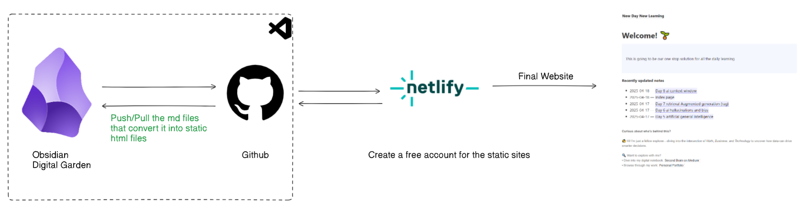

[](https://app.netlify.com/sites/digital-garden-jekyll-template/deploys)


# Digital garden Jekyll template

> [!note]
> Follow the steps bellow to set you own digital garden

- Clone the repo
```
git clone https://github.com/Ravikumar10593-hub/New-day-New-Learning.git
```
- Use the `_notes` folder to keep all your mark down files
- Create a netify account and connect it to this repo
    - Deploy the application, any change you make it to the github will be live in the site

> [!TIP]
> Use the below flow chart for better understanding


# Project flow



For any help, please raise a new issue.